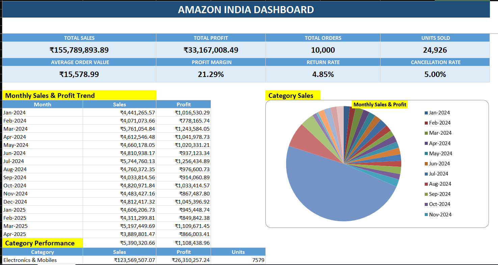

# Amazon India Sales Dashboard

## Project Overview

This project presents an interactive Amazon India Sales Dashboard
created using Microsoft Excel.

The dashboard helps analyze:

- Sales performance
- Profit performance
- Orders and units sold
- Average Order Value
- Profit Margin
- Monthly Sales and Profit
- Category performance
- Top 10 products
- Order status
- Returns and cancellations
- Payment methods
- Fulfillment methods
- State-wise performance

## Objectives

### OBJ_1 — Overall Sales & Profit Performance

- Total Sales
- Total Profit
- Total Orders
- Total Units Sold
- Average Order Value
- Profit Margin %
- Monthly Sales & Profit Trend

### OBJ_2 — Category & Product Performance

- Category-wise Sales
- Category-wise Profit
- Category-wise Units Sold
- Top 10 Products by Sales

### OBJ_3 — Order Status & Revenue Loss

- Delivered Orders
- Shipped Orders
- Returned Orders
- Cancelled Orders
- Return Rate %
- Cancellation Rate %
- Category-wise Returns & Cancellations

### OBJ_4 — Payment, Fulfillment & Geographic Performance

- Sales by Payment Method
- Profit by Payment Method
- Sales by Fulfillment Method
- Profit by Fulfillment Method
- State-wise Sales
- State-wise Profit
- State-wise Orders

## Tools Used

- Microsoft Excel
- PivotTables
- PivotCharts
- Excel Formulas
- Data Analysis
- Dashboard Design

## Key KPIs

| KPI | Value |
|---|---:|
| Total Sales | ₹155,789,893.89 |
| Total Profit | ₹33,167,008.49 |
| Total Orders | 10,000 |
| Total Units Sold | 24,926 |
| Average Order Value | ₹15,578.99 |
| Profit Margin | 21.29% |

## Dashboard Preview

## Project Files

- Excel Dashboard
- Complete Solution Documentation
- Assignment PDF
- Dashboard Screenshots

## Author

Your Name
